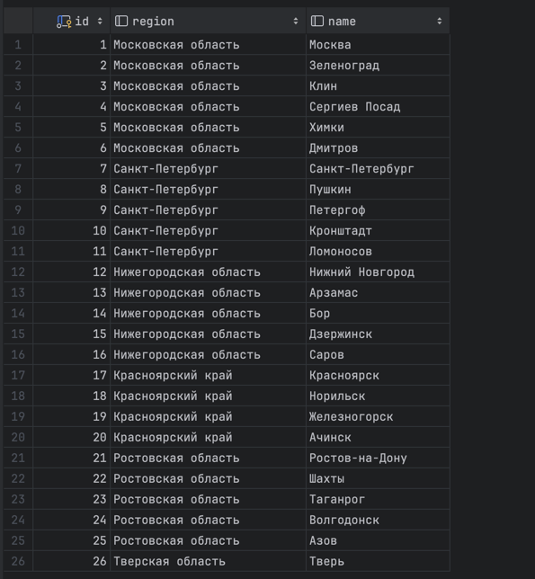
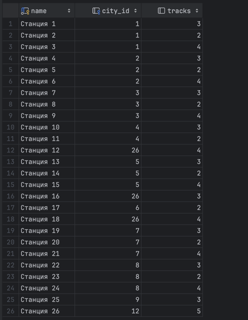
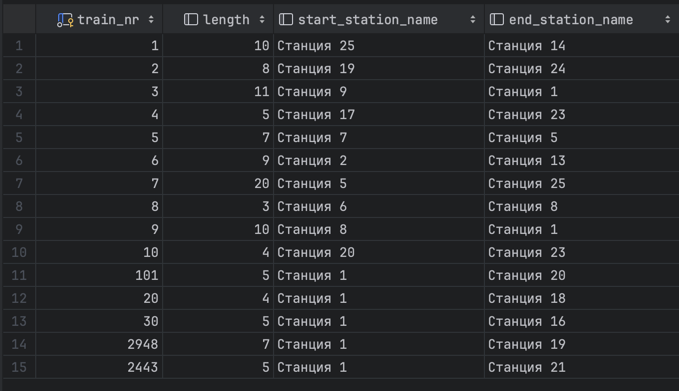
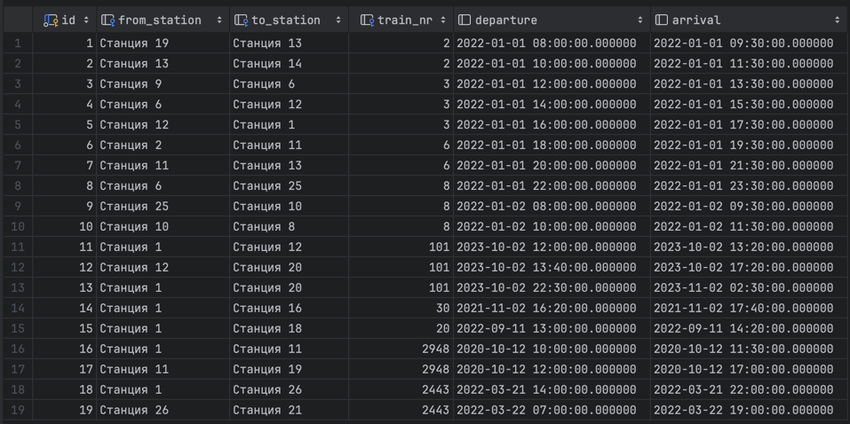
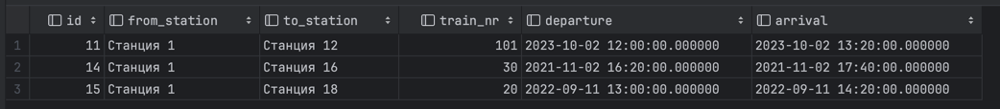
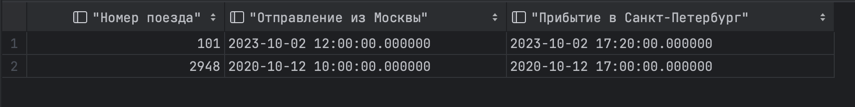

# 5 дз
## 1 задание
#### Данные в таблицах
1. Reader


2. Publisher


3. Book copies (Copy table)


4. Category


5. Borrowing


6. BookCategory


7. Book


#### Запросы и результаты
**а)** Запрос: 
```
SELECT last_name FROM yaglo_215.library."Reader" WHERE address LIKE '%Москва%';
```

Результат:


**б)** Запрос:
```
SELECT author, title FROM yaglo_215.library."Book" b
    JOIN yaglo_215.library."Copy" BC on b.isbn = BC.book_isbn
    JOIN yaglo_215.library."Borrowing" bor on BC.id = bor.book_copy
    JOIN yaglo_215.library."Reader" r on r.id = bor.reader_nr
    WHERE r.first_name LIKE 'Иван' AND r.last_name LIKE 'Иванов';
```

Результат:


**в)** Запрос:
```
SELECT isbn FROM yaglo_215.library."Book" b
    JOIN yaglo_215.library."BookCategory" BC on b.isbn = BC.book_isbn
    JOIN yaglo_215.library."Category" C on C.id = BC.category_id
    WHERE name = 'Горы' AND NOT b.isbn IN
    (SELECT isbn FROM yaglo_215.library."Book" book
                 JOIN yaglo_215.library."BookCategory" BC2 on book.isbn = BC2.book_isbn
                 JOIN yaglo_215.library."Category" C2 on C2.id = BC2.category_id
                 WHERE name = 'Путешествие');
```

Результат:


**г)** Запрос:
```
SELECT last_name, first_name FROM yaglo_215.library."Reader" r
    JOIN yaglo_215.library."Borrowing" B on r.id = B.reader_nr
    WHERE B.return_date is not null;
```

Результат:


**д)** Запрос:
```
SELECT last_name, first_name FROM yaglo_215.library."Reader" r
    JOIN yaglo_215.library."Borrowing" bor on r.id = bor.reader_nr
    JOIN yaglo_215.library."Copy" cop on bor.book_copy = cop.id
    WHERE cop.book_isbn
              IN (SELECT book_isbn FROM yaglo_215.library."Copy" cop1
                    JOIN yaglo_215.library."Borrowing" bor1
                        on cop1.id = bor1.book_copy
                    JOIN yaglo_215.library."Reader" r1
                        on bor1.reader_nr = r1.id
                    WHERE r1.first_name = 'Иван' AND r1.last_name = 'Иванов')
    AND (r.first_name not like 'Иван' OR r.last_name not like 'Иванов');
```

Результат:


## 2 задание
#### Данные в таблицах
1. City



2. Station



3. Train



4. Connection



#### Запросы и результаты
а) Запрос:
```
SELECT con.* FROM yaglo_215.trains."Connection" con
    JOIN yaglo_215.trains."Train" T on T.train_nr = con.train_nr
    JOIN yaglo_215.trains."Station" from_station on from_station.name = con.from_station
    JOIN yaglo_215.trains."Station" to_station on to_station.name = con.to_station
    JOIN yaglo_215.trains."City" from_city on from_station.city_id = from_city.id
    JOIN yaglo_215.trains."City" to_city on to_station.city_id = to_city.id
        WHERE from_city.name = 'Москва' AND to_city.name = 'Тверь';
```

Результат: 



б) Запрос:
```
SELECT con1.train_nr AS "Номер поезда", con1.departure AS "Отправление из Москвы",
       con2.arrival AS "Прибытие в Санкт-Петербург"
    FROM yaglo_215.trains."Connection" con1
    JOIN yaglo_215.trains."Connection" con2 ON con1.to_station = con2.from_station AND con1.arrival <= con2.departure
    JOIN yaglo_215.trains."Station" from_station ON con1.from_station = from_station.name
    JOIN yaglo_215.trains."Station" to_station ON con2.to_station = to_station.name
    JOIN trains."City" from_city on from_city.id = from_station.city_id
    JOIN trains."City" to_city on to_city.id = to_station.city_id
        WHERE from_city.name = 'Москва'
            AND to_city.name = 'Санкт-Петербург'
            AND con1.departure::DATE = con2.arrival::DATE
```

Результат:



